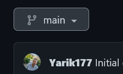
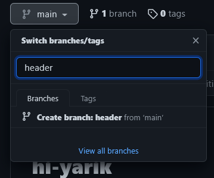

[<contents](./readme.md)

## Create a branch

---
---

 `1.` Click the Code tab of your *hi yarik* repository.

`2.` Click the drop down at the top of the file list that says **main**.

`3.` Type a branch name, **header**, into the text box.

`4.` Click **Create branch: header from main.**

Now you have two branches, **main** and **header**. Right now, they look exactly the same. Next you'll add changes to the new branch.

---