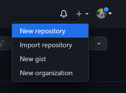
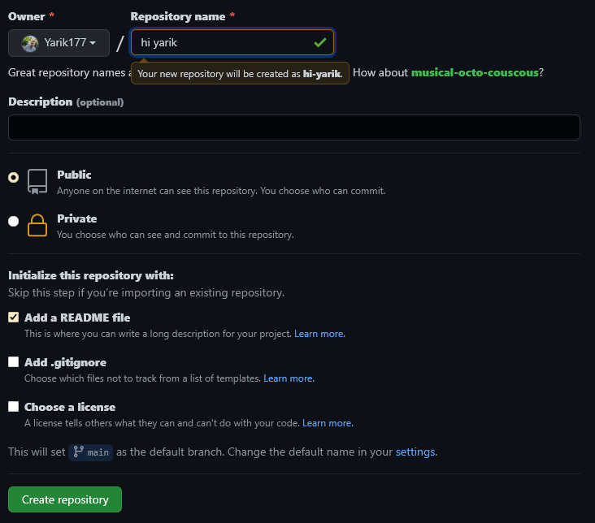

[<contents](./readme.md)

## Creating a repository

---
---

A *repository* is usually used to organize a single project. Repositories can contain folders and files, images, videos, spreadsheets, and data sets -- anything your project needs. Often, repositories include a **README** file, a file with information about your project. GitHub makes it easy to add one at the same time you create your new repository. It also offers other common options such as a license file.

Your repository can be a place where you store ideas, resources, or even share and discuss things with others.

`1.` In the upper-right corner of any page, use the  drop-down menu, and select New repository.
Drop-down with option to create a new repository

`2.` In the Repository name box, enter hi yarik.

`3.` In the Description box, write a short description.

`4.` Select Add a README file.

`5.` Click Create repository.

---